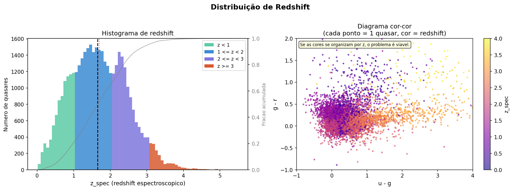
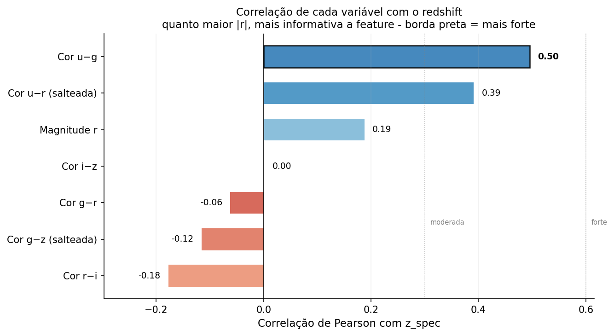
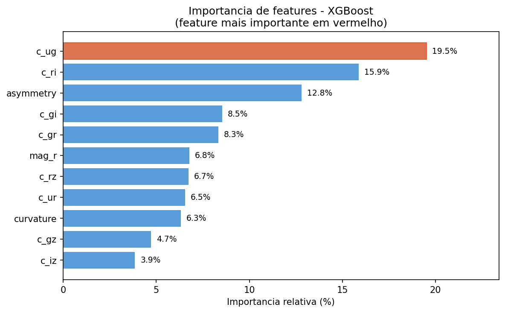
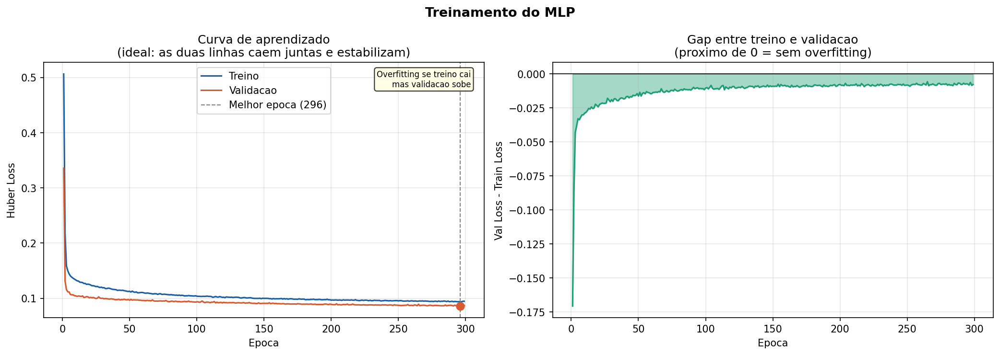
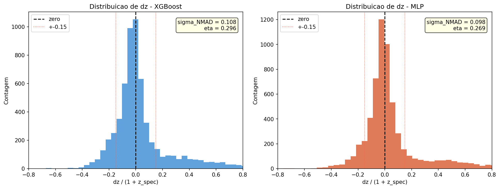
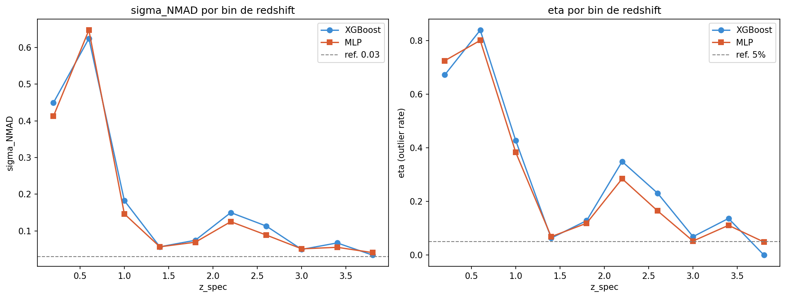

# 🔭 Previsão de Redshift Fotométrico de Quasares (SDSS DR18)

Telescópios modernos fotografam milhões de quasares, mas fazer espectroscopia
de cada um é lento e caro demais. A solução é o **redshift fotométrico**: usar
só o brilho em 5 filtros de cor (u, g, r, i, z) para estimar a distância do objeto.

Nesse projeto treinei modelos de machine learning usando dados reais do SDSS,
o maior catálogo astronômico do mundo, para prever o redshift de quasares
comparando com medições espectroscópicas como gabarito.

---

## O que é redshift?

Quando um objeto está muito longe, a luz que ele emitiu foi esticada pela
expansão do universo durante a viagem até nós. Esse esticamento é o redshift.
Medir ele com precisão nos diz a distância e a época em que a luz foi emitida.

---

## Modelos

- **XGBoost** - modelo baseline com gradient boosting
- **MLP** - rede neural com 3 camadas (PyTorch)

---

## Resultados

| Métrica | XGBoost | MLP |
|---|---|---|
| RMSE | 0.4852 | 0.4927 |
| sigma_NMAD | 0.1079 | **0.0980** |
| eta (>0.15) | 0.2959 | **0.2687** |

O MLP superou o XGBoost nas métricas mais importantes do campo de photo-z:
sigma_NMAD e eta.

---

## Gráficos

### Distribuição de redshift

**O que é:** um histograma mostrando quantos quasares existem em cada faixa de redshift,
com as barras coloridas por faixa e uma curva de densidade acumulada.

**Por que usar:** antes de treinar qualquer modelo é essencial entender como o alvo
está distribuído. Se o dataset tivesse só quasares de z baixo, o modelo nunca
aprenderia a prever z alto.

A maioria dos quasares está entre z=1 e z=2 (azul). Quasares com z acima
de 3 (laranja) são raros, o que explica por que o modelo tem mais dificuldade
nessa faixa: viu poucos exemplos no treino.

---

### Correlação de features com z_spec

**O que é:** um gráfico de barras horizontais mostrando a correlação de Pearson
entre cada variável e o redshift. Barras mais longas indicam relação linear mais forte.

**Por que usar:** ajuda a entender quais features têm mais potencial antes de
treinar o modelo. Economiza tempo e orienta o feature engineering.

A cor u-g é a mais correlacionada porque capta o deslocamento da quebra de
Lyman entre os filtros conforme z aumenta. Correlação baixa não significa
feature inútil: o modelo aprende relações não-lineares que esse gráfico não captura.

---

### Importância de features - XGBoost

**O que é:** mostra quais features o XGBoost mais usou para tomar decisões,
medido pelo ganho médio nos splits das árvores.

**Por que usar:** valida se o modelo está usando as features certas. Se uma feature
irrelevante aparecesse no topo, seria sinal de vazamento de dados ou bug.

Features de cor dominam o ranking, confirmando que a decisão de criar cores
em vez de usar magnitudes brutas foi correta.

---

### Curva de aprendizado - MLP

**O que é:** mostra como a loss de treino e validação evoluíram ao longo das épocas.
O segundo painel mostra o gap entre as duas curvas.

**Por que usar:** é a principal ferramenta para detectar overfitting. Se a loss de
treino cai mas a de validação sobe, o modelo está decorando os dados.

As duas curvas caem juntas e estabilizam sem se separar, indicando que o
modelo aprendeu sem overfitting.

---

### Distribuição de Δz

**O que é:** histograma dos erros normalizados de cada predição. As linhas
vermelhas tracejadas marcam o limite de outlier catastrófico em ±0.15.

**Por que usar:** o RMSE esconde onde os erros estão concentrados. Esse gráfico
mostra se o modelo tem viés sistemático e quão frequentes são os erros graves.

As duas distribuições estão centradas em zero, sem viés sistemático.
O MLP tem o pico mais estreito, confirmando sigma_NMAD menor.
As caudas longas indicam que quasares em z~0.5 são particularmente
difíceis de classificar por ambiguidade no espaço de cores.

---

### Métricas por faixa de redshift

**O que é:** sigma_NMAD e eta calculados separadamente para cada faixa de z,
mostrando onde o modelo acerta e onde falha.

**Por que usar:** uma métrica global esconde problemas locais. Um modelo pode
ter sigma_NMAD bom no geral mas ser péssimo em z alto, o que só aparece aqui.

O pico de erro em z~0.5 é o ponto mais problemático: as feições espectrais
estão numa posição ambígua entre os filtros. De z=1.5 até z=3 os dois modelos
ficam próximos da referência de 0.03. Em z alto as métricas melhoram porque
os poucos objetos nessa faixa têm padrões de cor mais distintos.

---

## Tecnologias

Python · PyTorch · XGBoost · scikit-learn · Plotly · Matplotlib · SDSS DR18

---

## O que aprendi

- Entender o problema antes de modelar é mais importante do que saber qual algoritmo usar
- Dados ruins produzem modelos ruins: antes de ajustar qualquer hiperparâmetro vale checar se os dados fazem sentido, no meu caso o modelo só funcionou depois de corrigir a query SQL que estava retornando só quasares de z baixo
- Um bug numa query SQL pode estragar completamente um modelo, os dados são tudo
